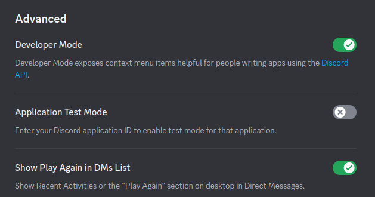
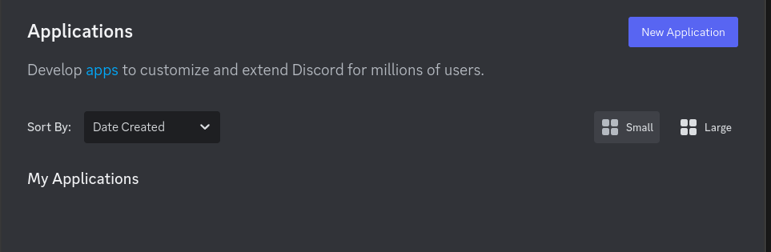

# Discord Bot

A simple guide to set up and configure a Discord Bot for your server.

---

## Instructions for Configuration for your own API Key 

1. **Enable Developer Mode**  
   - Go to your Discord server settings and enable *Developer Mode*.  
     

2. **Create a New Application**  
   - Visit the [Discord Developer Portal](https://discord.com/developers) and create a new application.  
     

3. **Set Up OAuth2 for Bot Permissions**  
   - Navigate to the *OAuth2* page within the Developer Portal.  
     - Select **Bot** as the scope.  
     - Configure the required permissions for your bot.  
     - Copy the generated link and paste it into your browser to authorize the bot for your server.

---

## Usage

1. Clone or download the repository of your choice.
2. Customize the bot's configuration and features to suit your needs.
3. Deploy the bot to your server and start managing it!

Happy bot building! 🎉

